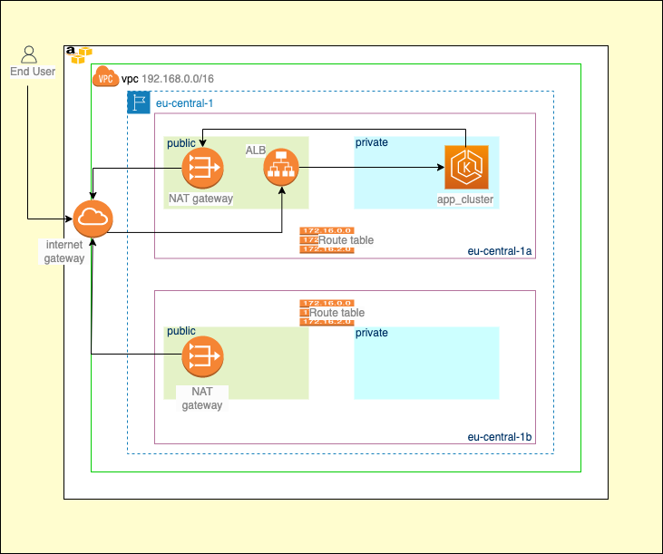
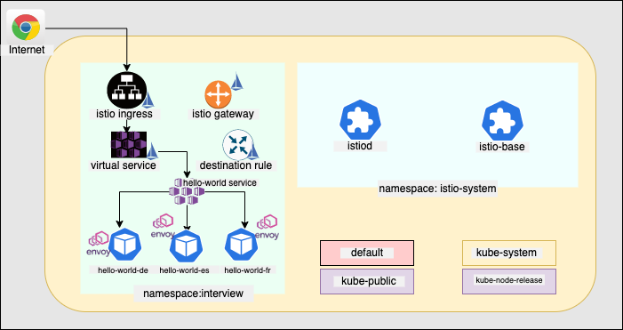

# Application Solution - Devops Assessment - Soham Roy 

### Requirement Gathering and Analysis

This document guide is for the MVP solution of three micro-services ( all private ). The cloud chosen is AWS. As of now the architecture needed is for only one environment with code to be built in a way that this can be used to create the infrastructure for production as well. The apps are deployed on EKS cluster.

For code reusability [**Terraform**](https://www.terraform.io) has been chosen as IaC.


### Tech Stack and Installation Guide

For the MVP the below tools are selected

**AWS CLI** | v1.2 | [Click here to install](https://docs.aws.amazon.com/cli/latest/userguide/install-cliv2-mac.html)

**Terraform** | >v0.13 | [Click here to install](https://learn.hashicorp.com/tutorials/terraform/install-cli)

**Kubectl** | v1.22 | [Click here to install](https://kubernetes.io/docs/tasks/tools/install-kubectl-macos/)


## Application Architecture 

Please refer to the  architecture diagram



### Detailed analysis:

**1. Network ( VPC, Subnets, Internet Gateway, NAT Gateway, NACL and Route Table ) :** The entire platform is hosted in 1 VPC ( region: eu-central-1 ). For *high-availability*, 1 public and 1 private subnet has been made per availability zone (eu-central-1a, eu-central-1b).

All the objects in the private subnet are routed via the *NAT gateway* (1 per public subnet) and for generic internet routing the Internet gateway is used. 2 *Elastic IPs* have been created for the 2 NAT gateways.

The public subnets have auto-assign of public ip enables for its object.

To **ssh** to the private servers you need to traverse via the **bastion server** (or jump server)

**2. Compute Objects (EKS ) :** EKS is deployed on private cluster with endpoint_public_access= true. This will allow the kubectl client to be run from locally. As this is a tech challenge there is one 1 node which has been used. The instance type used is t2.large as the lower models were going **out of memory**.

There are two main namespaces that has been used for this POC.

1. istio-system : To deploy the istio based k8 objects.
2. interview: Which contains the app, service and the network components.

The **istio-system** namespace contains the component of the istio service mesh ( istio-base and istiod). The **interview** namespace contains the deployment of hello-word.

All the apps are exposed on port **8000** and the service is exposed on port **80**.



## Deployment Guide

You need to ensure that the above mentioned tools are installed successfully. The best way is to check for the versions of the tool.

```bash

# for terraform version
terraform version
# for kubectl version
kubectl version short
# for aws-cli version
aws --version

```

Next step is to ensure that you have configured your aws profile so that can run terraform and packer

```bash

# aws configure
  <provide your access id>
  <provide your secret id>
  <provide your regionl ( eu-central-1)>
  <provide default type as json>
```

Download the code from github: 
```bash
git clone https://github.com/rsoham89/tc-allianz.git
```

```bash
# make alias of terraform init, plan and apply
  alias tfi='terraform init'
  alias tfp='terraform plan'
  alias tfa='terraform apply'

# assuming the home path as the base path
  cd ~/allianz/allianz_terraform/dev/storage_backup
# open vairables.tf and provide the necessary input
  tfi
  tfp
  tfa

```

Next is to create the neallianzork. Traverse to 

```bash
 cd ~/allianz/allianz_terraform/dev/neallianzork/
 
#modify the variables.tf as per your desired configuration

tfi

# the terraform init will configure the remote backend

tfp

#check for all the resources
tfa

#once done, this will show Apply Completed
```

Now we are set to create the compute objects and the secret manager

```bash
# we'll create the secret manager first

 cd ~/allianz/allianz_terraform/dev/secret-manager/
 
#modify the variables.tf as per your desired configuration

tfi

# the terraform init will configure the remote backend

tfp

#check for all the resources
tfa

#once done, this will show Apply Completed
```

Add the application token manually in the secret manager  using aws cli


Below is the command to store the key 

```bash
aws secretsmanager put-secret-value --secret-id <name_of_the_secret_id_(terraform)> --secret-string "<the token>"
```

and  to retrieve the key

```bash
aws secretsmanager get-secret-value --secret-id <name_of_secret> | jq .'SecretString' | sed 's/\"//g' 
```

Now we will create the bastion server

```bash
# go to the path of bastion server

 cd ~/allianz/allianz_terraform/dev/bastion/
 
#modify the variables.tf as per your desired configuration

tfi

# the terraform init will configure the remote backend

tfp

#check for all the resources
tfa

#once done, this will show Apply Completed
```

## Creating the base image for the application deployment

We will now take a break from terraform and create the base image. For this we will be using packer.

Go to the allianz_packer directory

```bash
# go to the path of bastion server

 cd ~/allianz/allianz_packer/

#update the vpc_id and subnet_id sections with the vpc id and one of the public subnet id

# validate packer

packer validate packer.json

# This should give you "The configuration is valid."

# then build the image

packer build packer.json
```

Once the build completes, store the **ami_id**. This image will be used as the base image for the 3 applications.

## Deploying the compute section

First we will deploy the Load Balancer, Target Group and Target Group listeners. The reason for this is we would be needed the *load balancer dns* of the newsfeed and quotes server to be in the startup script of the front-end app.

**Please select allianzo subnets from allianzo different availabity zones to and add in the variables.tf file** for the load balancers.

```bash

 ### we will deploy the front end alb

cd ~/allianz/allianz_terraform/dev/front-end-tf/elb/

vi variables.tf
-----------------------
variable "subnet_filter" {

  type = map(any)
  default = {
    name   = "tag:Name"
    value1 = "<Enter subnet 1>"
    value3 = "<Enter Subnet 2>"
  }
}
```

Continue with the **tfi, tfp and tfa**

Once the load balancer and the target groups are created go to the listener directory and apply **tfi, tfp, tfa**


```bash
cd ~/allianz/allianz_terraform/dev/front-end-tf/elb/listener/

tfi
tfp
tfa
```

*Repeat the same for Newsfeed and Quotes server*

The only difference is we will be implementing  **internal load balancers** in these allianzo, so we will be deploying in **private subnets**. Please configure the variables.tf accordingly

Path:

Newsfeed: **allianz/allianz_terraform/dev/newsfeed-tf**

Quotes: **allianz/allianz_terraform/dev/quotes**

Once all your load balancers are deployed and your dns is available update your startup script with the dns of the load balancers.

```bash

cd ~/allianz/allianz_terraform/dev/scripts
vi startup_FE.sh
.
.
.
export STATIC_URL=<url_of_frontend>:8000
export QUOTE_SERVICE_URL=<url_of_Quotes>
export NEWSFEED_SERVICE_URL=<url_of_Newsfeed>
.
.
.
```

**Assumption:**  *You have a key pair generated in the name of allianz and you have allianz.pem in your local and the public key in the aws key-pair*

If you want to replace this with any other key pair please mention the same in here 

**~/allianz/allianz_terraform/tf-modules/ec2**

```bash
cat variables.tf
.
.
.

variable "key_name" {
  type = "string"
  default = "allianz" # replace here

}
.
.
.

```

now we move to the directories of the quotes, newsfeed and front end ec2 and do the terraform trio:


```bash
# go to the newsfeed directory
cd ~/allianz/allianz_terraform/dev/newsfeed-tf/ec2/
tfi
tfp
tpa

#go to the quotes directory
~/allianz/allianz_terraform/dev/quotes-tf/ec2/

tfi
tfp
tpa

#go to the front end directory
~/allianz/allianz_terraform/dev/front-end-tf/ec2/

tfi
tfp
tpa
```

And that's it, your all three micro services are deployed.


